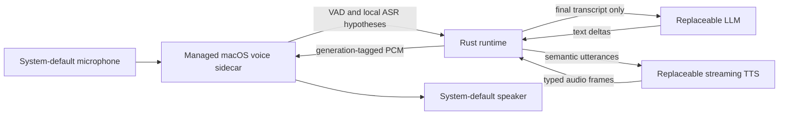

# Conversation Runtime SDK

> Models are replaceable components. The runtime is the product.

Conversation Runtime SDK is a local-first foundation for natural, interruptible voice conversations. It owns turn lifecycle, pacing, cancellation, persona, memory, and user boundaries while keeping ASR, language, and speech models replaceable.

The SDK is cross-platform by design. The first validated product target is macOS on Apple Silicon, where the project can prove a low-latency local voice loop before taking on additional operating-system integrations.

## Current Status

The repository now contains the deterministic runtime foundation, reviewed local text-to-audio reference paths, and the deterministic R3 real-time voice implementation:

- typed commands, events, turn identifiers, and errors;
- cancellation-aware language-model and speech-synthesis adapter contracts;
- deterministic mock adapters that require no downloaded models;
- single-active-turn orchestration with exactly one terminal event;
- integration tests for completion, interruption races, adapter failures, synthesis cancellation, and runtime reuse;
- a streaming Ollama adapter with bounded NDJSON framing, cancellation, and configurable thinking;
- a runnable local text probe that selects an installed Ollama model by exact identifier, subject to that model supporting the fixed probe policy;
- reproducible feasibility results for three local checkpoints under one bounded 8K-context profile;
- typed synthesized audio, cleanup-aware speech cancellation, and a bounded macOS system-speech reference adapter;
- a runnable typed-text probe with optional AIFF persistence, playback, cancellation, and distinct timeout reporting;
- a deterministic OpenAI-compatible local HTTP speech adapter and probe profiles for measured neural-TTS evaluation candidates;
- a generic `AudioOutput` boundary with bounded macOS `afplay` reference output;
- UTF-8-safe phrase segmentation that coalesces short punctuation-separated clauses while retaining hard byte limits;
- speech-only Markdown and story-heading normalization that preserves the original text stream, including literal content such as `C#` and `2*3`;
- a bounded two-stage speech pipeline that may prefetch exactly one synthesized segment while the current segment plays;
- runtime timing events for first text delta, first synthesis request, and first playable audio;
- an integrated voice probe that composes replaceable language, speech, and audio-output adapters behind `ConversationRuntime`;
- schema-v2 local voice-session policy, generation-safe streaming contracts, and a managed macOS sidecar protocol;
- a Swift macOS voice-processing sidecar with local recognition and continuous generation-tagged PCM playback;
- explicit buffered and streaming OpenAI-compatible speech modes, with checked concatenated-RIFF parsing and no streaming-to-buffered fallback; and
- a bounded ten-minute acceptance harness plus an external acoustic measurement procedure.

The integrated typed-text-to-audio path and deterministic R3 contracts are implemented and test-covered. The Task 12 gate recorded `433` passing Rust tests plus one intentionally ignored fixture writer and `102` passing Swift tests. The real schema-v2 microphone, local ASR, streaming speech, shared audio-engine, and barge-in path exists in source, but the required private configuration and local ASR model are absent from the recorded Task 12 environment. A ten-minute device run and the 30-sample acoustic procedure have therefore not been performed. R3 is not complete, and no first-audible or audible-stop latency is claimed. See [the R3 evaluation](docs/r3-real-time-voice-evaluation.md) and [ROADMAP.md](ROADMAP.md).

## R3 Target Architecture



The first real-time slice keeps capture, Apple echo cancellation, local
WhisperKit recognition, and continuous playback in one managed macOS audio
sidecar. Rust enforces the immutable session privacy policy, finalizes a turn
after approximately `600 ms` of silence, and cancels generation, synthesis,
queued audio, and playback after approximately `200 ms` of sustained user speech.
Partial transcripts remain display-only. `LocalOnly` rejects remote or
undeclared adapters before microphone access and never falls back silently.

The deterministic implementation now follows this architecture. Process/device
continuity and acoustic output remain separate unvalidated evidence classes. See
[docs/architecture.md](docs/architecture.md) for the canonical diagram and
[the R3 design](docs/superpowers/specs/2026-07-28-r3-real-time-voice-loop-design.md)
for the complete privacy, protocol, lifecycle, and acceptance rules.

## Test Local Inference

Start Ollama, then run the reviewed probe against an installed model:

```bash
cargo run --locked -p conversation-ollama-probe -- \
  "<installed-model-id>" \
  "Answer briefly: hello"
```

The response streams to standard output. The exact model identifier, first text-delta time, and total time are written to standard error. The probe uses `http://127.0.0.1:11434` by default and accepts another endpoint through `OLLAMA_ENDPOINT`.

The probe explicitly sets `think: false`, temperature `0`, seed `42`, a 128-token output cap, and an 8K context window. It performs no prompt or response file writes itself; prompts passed as arguments can still appear in shell history or process inspection. See [docs/model-benchmarks.md](docs/model-benchmarks.md) for measured results and limitations.

## Test Local Speech

On macOS, list installed system voices:

```bash
cargo run --locked -p conversation-tts-probe -- --list-voices
```

Downloaded Apple voices become visible after installation. Voice and profile availability differs by machine. macOS voice selection chooses an installed system voice; it does not provide arbitrary voice cloning.

Run the system-speech reference flow with a selected voice and speaking rate:

```bash
cargo run --locked -p conversation-tts-probe -- \
  --voice "Tingting" \
  --rate 180 \
  "你好，这是本地中文语音。"
```

Run a named voice profile from an absolute configuration path:

```bash
cargo run --locked -p conversation-tts-probe -- \
  --config "$PWD/configs/speech.example.toml" \
  --profile mandarin \
  "你好，这是命名语音配置。"
```

The original system-speech reference flow remains available:

```bash
cargo run --locked -p conversation-tts-probe -- \
  "This is a local system-speech reference adapter."
```

Use `--no-play` to synthesize silently and absolute `--output <path>` to retain audio explicitly (AIFF for macOS system speech, WAV for the local HTTP adapter). Configuration precedence is `CLI > environment > selected profile > macOS system defaults`. Configuration supports `backend = "macos-system"` and `backend = "openai-compatible"`. `--config` paths must be absolute and the files are bounded to 64 KiB. Optional environment controls and validation details are documented in [tests/tts/README.md](tests/tts/README.md). Synthesis completion and playback launch are plumbing metrics, not measurements of first playable audio.

### Evaluate Local Neural TTS

The local HTTP adapter is deterministic and test-covered, but its MLX-Audio profiles are evaluation candidates rather than SDK defaults or a model selection. Install the verified MLX-Audio server tool, keep it bound to loopback, and run the fast candidate:

```bash
uv tool install --force "mlx-audio[server]==0.4.6" --prerelease=allow
mlx_audio.server --host 127.0.0.1 --port 8000
rustup run 1.97.1 cargo run --locked -p conversation-tts-probe -- \
  --config "$PWD/configs/speech.mlx-audio.example.toml" \
  --profile local-neural-fast \
  "你好，这是本地神经语音测试。"
```

The convenient public profiles use repository IDs that can resolve newer model revisions, so they do not reproduce the recorded benchmarks. They cap generation at `max_tokens = 128` and use `repetition_penalty = 1.05`; an uncapped host default produced impractically long audio during evaluation. See [docs/neural-tts-evaluation.md](docs/neural-tts-evaluation.md) for the exact snapshot download, digest verification, private local-path configuration, measured results, and remaining quality gates. Model files stay outside this repository, and the Rust command uses the pinned project toolchain.

## Run the Integrated Text-to-Audio Probe

Copy the generic reference composition to a private absolute path, then replace its placeholder identifiers and loopback endpoints with installed local services:

```bash
PRIVATE_VOICE_CONFIG="${XDG_CONFIG_HOME:-$HOME/.config}/conversation-runtime/voice.toml"
mkdir -p "$(dirname "$PRIVATE_VOICE_CONFIG")"
cp configs/voice.example.toml "$PRIVATE_VOICE_CONFIG"
```

Keep that private file outside version control. Start the configured loopback language and speech services separately, then run one typed turn:

```bash
cargo run --locked -p conversation-voice-probe -- \
  --config "$PRIVATE_VOICE_CONFIG" \
  "Answer in two short sentences: 你好，请简短介绍你自己。"
```

Text deltas go to standard output unchanged. For speech only, short punctuation-separated clauses are coalesced, supported Markdown formatting markers are removed while their content is retained, and story headings are converted to spoken prose without decorative title brackets or section ordinals. One synthesized segment may be prefetched during playback. Stable timing milestones and the terminal status go to standard error. `SIGINT` requests runtime interruption and waits for generation, synthesis, queued speech, active playback, and temporary-file cleanup. Use `--no-play` only as a diagnostic path.

The public template demonstrates one reference composition; it does not select a deployment model, voice, or backend policy. See [docs/runtime-text-to-audio-evaluation.md](docs/runtime-text-to-audio-evaluation.md) for deterministic evidence, the historical integration benchmark, the later process-level continuity check, timing definitions, and evidence limits.

## Run the Real-Time Voice CLI

Build the Rust CLI and macOS sidecar without starting capture:

```bash
cargo build --locked --release -p conversation-voice-probe \
  --bin conversation-voice-loop
tests/voice/build-macos-sidecar.sh
```

Copy the public schema-v2 template to a private absolute path outside the
repository. Replace every placeholder with installed local components,
including the absolute ASR model directory and sidecar executable. Do not
commit the private file.

```bash
PRIVATE_SESSION_CONFIG="${XDG_CONFIG_HOME:-$HOME/.config}/conversation-runtime/voice-session.toml"
mkdir -p "$(dirname "$PRIVATE_SESSION_CONFIG")"
cp configs/voice-session.example.toml "$PRIVATE_SESSION_CONFIG"
```

Streaming is explicit. The private file must contain these exact public
reference settings to select streaming:

```toml
[speech]
mode = "streaming"
streaming_interval = 0.32
```

Use `mode = "buffered"` only as an explicit compatibility choice and omit
`streaming_interval` in that mode. An unsupported streaming backend fails at
the speech adapter; the runtime never falls back to buffered synthesis.

After privately configuring installed local services, run:

```bash
target/release/conversation-voice-loop \
  --config "$PRIVATE_SESSION_CONFIG"
```

The ten-minute harness discards transcript output, records only bounded
content-free JSONL metrics, and refuses repository output. The metrics path
must not already exist; the harness atomically creates a regular `0600` file
without following links while leaving the containing directory unchanged:

```bash
tests/voice/acceptance-macos.sh \
  --config "$PRIVATE_SESSION_CONFIG" \
  --duration-seconds 600 \
  --metrics /private/tmp/conversation-runtime-r3-metrics.jsonl
```

`first_playable_audio_ms`, sidecar acceptance, and render acknowledgement are
process milestones. First audible sound and audible interruption stop require
the external procedure in
[tests/voice/acoustic/README.md](tests/voice/acoustic/README.md).

## Project Layout

```text
apps/desktop/          Desktop reference-app boundary
configs/               Safe, portable configuration examples
crates/protocol/       Public commands, events, identifiers, and errors
crates/model-adapters/ Replaceable model contracts and test doubles
crates/runtime/        Turn orchestration and interruption behavior
docs/                  Architecture, design, and benchmark guidance
models/                Registry schema and local model instructions
tests/latency/         Runnable mock latency probe and metric definitions
tests/ollama/          Runnable local Ollama text probe
tests/tts/             Runnable macOS system-speech and playback probe
tests/voice/           Typed and real-time voice CLIs, sidecar fixtures, and acceptance harnesses
```

## Development

Install Rust with [rustup](https://www.rust-lang.org/tools/install), verify `cargo --version`, then run:

```bash
cargo fmt --all -- --check
cargo clippy --workspace --all-targets --locked -- -D warnings
cargo test --workspace --locked
cargo run -p conversation-latency-harness -- "hello runtime"
```

The workspace commands use the toolchain pinned in `rust-toolchain.toml`.

The latency probe uses deterministic mock adapters. It verifies runtime flow and prints timing fields, but it is not evidence that the product latency target has been met.

## Design Constraints

- One active turn per runtime instance.
- Turn identifiers increase strictly per runtime instance.
- One terminal event per turn: completed, cancelled, or failed.
- Interruption cancels downstream work; it is not a playback mute.
- The protocol does not depend on adapters or runtime internals.
- Relationship behavior emerges from context and conversation state rather than fixed scripts: earned behavior is often more memorable than configurable behavior.
- Model files, private paths, credentials, and local benchmark artifacts stay outside version control.
- Public SDK content remains backend-neutral. Exact deployment-model choices and application-specific routing policy stay in deployment configuration outside this repository.

See [docs/architecture.md](docs/architecture.md) for the current boundaries, [docs/superpowers/specs/2026-07-24-conversation-runtime-sdk-design.md](docs/superpowers/specs/2026-07-24-conversation-runtime-sdk-design.md) for the approved initial design, and [docs/superpowers/specs/2026-07-24-ollama-local-model-and-lan-design.md](docs/superpowers/specs/2026-07-24-ollama-local-model-and-lan-design.md) for the Mac, SQLite, LAN, and future-platform architecture.
