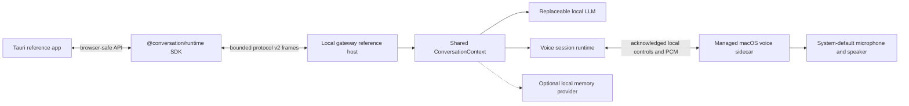

# Conversation Runtime SDK

> **Tier: standalone public product.** Independent of every other repository;
> no deployment or data coupling.

> Models are replaceable components. The runtime is the product.

Conversation Runtime SDK is a local-first foundation for natural, interruptible
voice conversations. It owns turn lifecycle, pacing, cancellation, persona,
memory, and user boundaries while keeping ASR, language, and speech models
replaceable.

The SDK is cross-platform by design. The first validated product target is
macOS on Apple Silicon, where the project proves a low-latency local voice loop
before taking on additional operating-system integrations.

## Status

R0 through R5 are complete. R3 (real-time voice loop and barge-in) was closed
by product-owner acceptance on 2026-08-23. R6 (desktop reference app and SDK
boundary) is in progress: the local gateway, public TypeScript SDK, Node
example, and macOS desktop app with shared typed/spoken conversation, Voice
Focus, persona controls, memory review, and session continuation are built and
covered by deterministic gates. Guided setup UI, packaging and signing, and
product-owner visual acceptance remain open.

What the repository contains today:

- **Rust runtime** with typed commands and events, single-active-turn
  orchestration, exactly one terminal event per turn, and cancellation that
  reaches generation, synthesis, queued audio, and playback.
- **Replaceable adapters**: a streaming Ollama-compatible language adapter, a
  macOS system-speech adapter, an OpenAI-compatible local HTTP speech adapter
  with buffered and streaming modes, and deterministic mocks that need no
  downloaded models.
- **Real-time voice loop**: a managed Swift macOS sidecar for capture, echo
  cancellation, local recognition, and generation-tagged playback, driven by a
  schema-v1 local-only session policy.
- **Conversation quality controls**: visible persona dimensions, four
  conversation modes, response limits, temporary corrections, and content-free
  quality decisions.
- **Controlled local memory**: an explicitly initialized SQLite store with
  revision-checked mutation, approval-gated identity and relationship records,
  bounded retrieval, optional extraction of memory candidates from completed
  exchanges, and content-free traces.
- **Local gateway**: a persistent Rust host speaking bounded framed JSON over
  child-process stdin and stdout, with no network listener. It can optionally
  supervise a configured local provider process with an explicit executable,
  readiness URL, startup timeout, and cleanup.
- **Public TypeScript SDK** (`@conversation/runtime`) with a Node stdio
  transport and a browser-safe entry, speaking public protocol v2.
- **Reference clients**: a minimal Node chat example and a macOS Tauri desktop
  app.

The complete Rust workspace, strict Clippy and formatting gates, the acceptance
harness suite, the Swift sidecar tests, and the TypeScript workspaces pass.
[ROADMAP.md](ROADMAP.md) is the authoritative per-release status. Evidence
lives in the evaluations under [docs/](docs/):
[R3](docs/r3-real-time-voice-evaluation.md),
[R4](docs/r4-conversation-quality-evaluation.md),
[R5](docs/r5-controlled-memory-evaluation.md),
[R6 gateway](docs/r6-local-gateway-evaluation.md), and
[R6 desktop](docs/r6-desktop-app-evaluation.md).

## Architecture



The SDK owns transport-neutral commands, events, validation, and lifecycle
handles. The runtime owns turn identifiers, arbitration, completed context,
persona and quality decisions, optional memory, and cancellation across typed
and spoken turns. The gateway is the local reference host: it loads private
configuration, composes adapters, and owns child-process cleanup. The desktop
is a reference application: it owns presentation, explicit microphone intent,
Focus preferences, and its own transcript history. Entering Voice Focus never
starts capture; only `Start voice` does. No layer silently falls back to a
remote provider.

Rust finalizes a spoken turn after roughly `600 ms` of silence and cancels
generation, synthesis, queued audio, and playback after roughly `200 ms` of
sustained user speech. Partial transcripts stay display-only. `LocalOnly`
rejects remote or undeclared adapters before microphone access.

See [docs/architecture.md](docs/architecture.md) for the canonical diagrams,
ownership rules, invariants, and cancellation semantics.

## Quick Start

Install Rust with [rustup](https://www.rust-lang.org/tools/install) (the
workspace pins its toolchain in `rust-toolchain.toml`) and Node, then build:

```bash
npm ci
cargo build --locked -p conversation-runtime-gateway
npm run build --workspaces
```

Copy the example gateway configuration to a private absolute path outside
version control and point its loopback endpoint and model placeholder at a
local service already running on this machine:

```bash
PRIVATE_GATEWAY_CONFIG="${XDG_CONFIG_HOME:-$HOME/.config}/conversation-runtime/gateway.toml"
mkdir -p "$(dirname "$PRIVATE_GATEWAY_CONFIG")"
cp configs/gateway.example.toml "$PRIVATE_GATEWAY_CONFIG"
${EDITOR:-vi} "$PRIVATE_GATEWAY_CONFIG"
```

Public examples contain generic provider, model, and voice identifiers. Choose
exact local values only in the private copy.

### Node chat

```bash
npm run chat --workspace conversation-node-chat -- \
  --gateway "$PWD/target/debug/conversation-runtime-gateway" \
  --config "$PRIVATE_GATEWAY_CONFIG"
```

The client prints the local-only privacy status, keeps one gateway process
alive across turns, and streams `text_delta` content. During an active turn
the first `SIGINT` requests interruption. A second `SIGINT`, an idle `SIGINT`,
or end-of-input closes the client and gateway.

### Desktop app

For text-only use, leave the `[voice.*]` blocks commented. For local voice,
build the sidecar and set the voice subtree in the private configuration:

```bash
swift build -c release --package-path platform/macos/voice-sidecar
printf '%s/conversation-voice-sidecar\n' "$(swift build -c release \
  --package-path platform/macos/voice-sidecar --show-bin-path)"
```

Then launch the development app and enter the absolute gateway and
configuration paths in its setup screen:

```bash
npm run desktop:dev
printf 'Gateway: %s\nConfig: %s\n' \
  "$PWD/target/debug/conversation-runtime-gateway" \
  "$PRIVATE_GATEWAY_CONFIG"
```

Voice behavior, session history and continuation, memory review, persona
settings, and protocol compatibility are documented in
[the desktop README](apps/desktop/README.md). Hardware-dependent checks are in
[the native acceptance checklist](docs/r6-desktop-voice-session-native-check.md).

## Configuration Notes

Schema-v1 session configuration accepts optional `[persona]`, `[response]`,
and `[quality_metrics]` sections with explicit defaults:

```toml
[persona]
warmth = 0.8
humor = 0.6
teasing = 0.4
initiative = 0.35
directness = 0.8
intimacy = 0.3
verbosity = 0.2
follow_up_frequency = 0.25

[response]
mode = "direct-answer"
maximum_spoken_seconds = 20
pace = "natural"
allow_silence = true
ask_follow_up_by_default = false

[quality_metrics]
enabled = true
record_content = false
```

Modes are `direct-answer`, `companionship`, `brainstorming`, and `reflective`.
Pace values are `measured`, `natural`, and `brisk`. Persona values are finite
`0.0..=1.0` inputs. `record_content = true` is rejected because quality metrics
are content-free by contract. Temporary corrections never overwrite the saved
persona, and only completed exchanges enter the bounded in-session history.

Memory is opt-in. The runtime never creates the database during startup and
never turns transcripts into durable records unless extraction is explicitly
configured. Initialize and inspect a store with the probe:

```bash
MEMORY_DB="$HOME/Library/Application Support/Conversation Runtime/runtime.sqlite3"
cargo run --locked -p conversation-memory-probe -- --database "$MEMORY_DB" init
cargo run --locked -p conversation-memory-probe -- --database "$MEMORY_DB" \
  add --kind semantic --content "Prefers concise technical explanations"
cargo run --locked -p conversation-memory-probe -- --database "$MEMORY_DB" list
```

The probe also supports `inspect`, `edit`, `pin`, `unpin`, `approve`, `expire`,
`delete`, and bounded `retrieve`. Mutations require the current revision.
Identity and relationship records remain candidates until approved. Retrieval
defaults to four records and `4096` content bytes with hard ceilings of eight
records and `8192` bytes, and retrieved memory is passed to the language model
as a separate, labeled untrusted message. Hard deletion removes the record and
its provenance rows but is not secure erasure of filesystem or backup remnants.

To use the store from a gateway or voice session, uncomment the memory block in
the private configuration and set an absolute path to the initialized database.
Memory and language execution must both be local; missing, relative, or remote
configurations fail before startup.

## Probes and Evaluation Tools

Each probe exercises one boundary in isolation. None selects a deployment
model, voice, or backend.

**Local inference** (requires a running Ollama-compatible service):

```bash
cargo run --locked -p conversation-ollama-probe -- \
  "<installed-model-id>" "Answer briefly: hello"
```

The probe fixes `think: false`, temperature `0`, seed `42`, a 128-token cap,
and an 8K context. Results and limits are in
[docs/model-benchmarks.md](docs/model-benchmarks.md).

**Local speech** (macOS system voices or an OpenAI-compatible local HTTP host):

```bash
cargo run --locked -p conversation-tts-probe -- --list-voices
cargo run --locked -p conversation-tts-probe -- --voice "Tingting" --rate 180 \
  "你好，这是本地中文语音。"
cargo run --locked -p conversation-tts-probe -- \
  --config "$PWD/configs/speech.example.toml" --profile mandarin \
  "你好，这是命名语音配置。"
```

Precedence is `CLI > environment > selected profile > macOS system defaults`.
Options and the MLX-Audio evaluation profiles are documented in
[tests/tts/README.md](tests/tts/README.md) and
[docs/neural-tts-evaluation.md](docs/neural-tts-evaluation.md).

**Integrated text-to-audio** (one typed turn through language, speech, and
audio output):

```bash
PRIVATE_VOICE_CONFIG="${XDG_CONFIG_HOME:-$HOME/.config}/conversation-runtime/voice.toml"
mkdir -p "$(dirname "$PRIVATE_VOICE_CONFIG")"
cp configs/voice.example.toml "$PRIVATE_VOICE_CONFIG"
cargo run --locked -p conversation-voice-probe -- --config "$PRIVATE_VOICE_CONFIG" \
  "Answer in two short sentences: 你好，请简短介绍你自己。"
```

See [docs/runtime-text-to-audio-evaluation.md](docs/runtime-text-to-audio-evaluation.md).

**Real-time voice CLI and acceptance harness**:

```bash
cargo build --locked --release -p conversation-voice-probe --bin conversation-voice-loop
install -m 755 "$(tests/voice/build-macos-sidecar.sh)" target/release/conversation-voice-sidecar

PRIVATE_SESSION_CONFIG="${XDG_CONFIG_HOME:-$HOME/.config}/conversation-runtime/voice-session.toml"
mkdir -p "$(dirname "$PRIVATE_SESSION_CONFIG")"
cp configs/voice-session.example.toml "$PRIVATE_SESSION_CONFIG"

target/release/conversation-voice-loop --config "$PRIVATE_SESSION_CONFIG" --once
```

The CLI resolves the sidecar beside its own executable, never through ambient
`PATH`. Streaming speech is explicit (`[speech] mode = "streaming"`) and never
falls back to buffered synthesis. The ten-minute harness in
`tests/voice/acceptance-macos.sh` records content-free JSONL metrics to a
private directory and requires observed completed turns and interruptions, not
just process uptime. First audible sound and audible interruption stop need the
external procedure in [tests/voice/acoustic/README.md](tests/voice/acoustic/README.md).

**Latency harness** (deterministic mocks, verifies flow rather than a latency
target):

```bash
cargo run -p conversation-latency-harness -- "hello runtime"
```

## Project Layout

```text
apps/desktop/          macOS Tauri desktop reference app
apps/runtime-gateway/  Persistent local-only framed-stdio gateway
configs/               Safe, portable configuration examples
crates/protocol/       Public commands, events, identifiers, and errors
crates/model-adapters/ Replaceable model contracts and test doubles
crates/memory/         Backend-neutral memory contracts and SQLite reference store
crates/runtime/        Turn orchestration and interruption behavior
docs/                  Architecture, evaluations, and design history
examples/node-chat/    Minimal persistent TypeScript chat client
models/                Registry schema and local model instructions
packages/typescript/   Public @conversation/runtime TypeScript SDK
platform/macos/        Managed macOS voice sidecar package
tests/latency/         Runnable mock latency probe and metric definitions
tests/memory/          Explicit local memory control probe
tests/ollama/          Runnable local Ollama text probe
tests/tts/             Runnable macOS system-speech and playback probe
tests/voice/           Typed and real-time voice CLIs, sidecar fixtures, and acceptance harnesses
```

## Development

```bash
cargo fmt --all -- --check
cargo clippy --workspace --all-targets --locked -- -D warnings
cargo test --workspace --locked
npm ci
npm run build --workspaces
npm test --workspaces
```

The Node example suite compiles the real Rust gateway and binds a temporary
loopback-only deterministic provider to verify framed-pipe completion and
cancellation. It does not measure latency or model quality.

## Design Constraints

- One active turn per runtime instance; turn identifiers increase strictly.
- One terminal event per turn: completed, cancelled, or failed.
- Interruption cancels downstream work; it is not a playback mute.
- The protocol does not depend on adapters or runtime internals.
- Relationship behavior emerges from context and conversation state rather
  than fixed scripts. There is no affection switch, unlock level, or counter.
- Model files, private paths, credentials, and local benchmark artifacts stay
  outside version control.
- Public SDK content remains backend-neutral. Exact deployment-model choices
  and application-specific routing policy stay in configuration outside this
  repository.

Design history lives under [docs/superpowers/specs](docs/superpowers/specs/)
and [docs/superpowers/plans](docs/superpowers/plans/), starting from
[the initial design](docs/superpowers/specs/2026-07-24-conversation-runtime-sdk-design.md).
