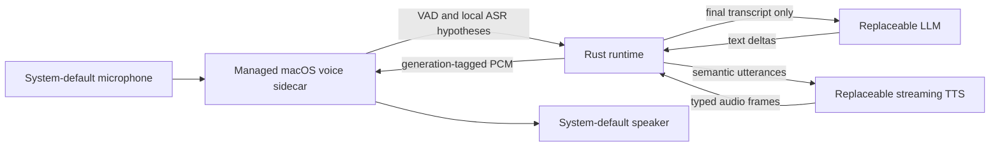

# Conversation Runtime SDK

> Models are replaceable components. The runtime is the product.

Conversation Runtime SDK is a local-first foundation for natural, interruptible voice conversations. It owns turn lifecycle, pacing, cancellation, persona, memory, and user boundaries while keeping ASR, language, and speech models replaceable.

The SDK is cross-platform by design. The first validated product target is macOS on Apple Silicon, where the project can prove a low-latency local voice loop before taking on additional operating-system integrations.

## Current Status

The repository now contains the deterministic runtime foundation, reviewed local text-to-audio reference paths, the deterministic R3 real-time voice implementation, bounded R4 conversation quality controls, the R5 controlled-memory reference path, and the first R6 local-gateway and desktop slices:

- typed commands, events, turn identifiers, and errors;
- cancellation-aware language-model and speech-synthesis adapter contracts;
- deterministic mock adapters that require no downloaded models;
- single-active-turn orchestration with exactly one terminal event;
- integration tests for completion, interruption races, adapter failures, synthesis cancellation, and runtime reuse;
- a streaming Ollama adapter with bounded NDJSON framing, cancellation, and configurable thinking;
- a runnable local text probe that selects an installed Ollama model by exact identifier, subject to that model supporting the fixed probe policy;
- reproducible feasibility results for three local checkpoints under one bounded 8K-context profile;
- typed synthesized audio, cleanup-aware speech cancellation, and a bounded macOS system-speech reference adapter;
- a runnable typed-text probe with optional AIFF persistence, playback, cancellation, and distinct timeout reporting;
- a deterministic OpenAI-compatible local HTTP speech adapter and probe profiles for measured neural-TTS evaluation candidates;
- a generic `AudioOutput` boundary with bounded macOS `afplay` reference output;
- UTF-8-safe phrase segmentation that coalesces short punctuation-separated clauses while retaining hard byte limits;
- speech-only Markdown and story-heading normalization that preserves the original text stream, including literal content such as `C#` and `2*3`;
- a bounded two-stage speech pipeline that may prefetch exactly one synthesized segment while the current segment plays;
- runtime timing events for first text delta, first synthesis request, and first playable audio;
- an integrated voice probe that composes replaceable language, speech, and audio-output adapters behind `ConversationRuntime`;
- schema-v2 local voice-session policy, generation-safe streaming contracts, and a managed macOS sidecar protocol;
- a Swift macOS voice-processing sidecar with local recognition and continuous generation-tagged PCM playback;
- explicit buffered and streaming OpenAI-compatible speech modes, with checked concatenated-RIFF parsing and no streaming-to-buffered fallback;
- a bounded ten-minute acceptance harness plus an external acoustic measurement procedure;
- typed persona, mode, response, signal, bounded-history, and content-free
  quality-decision contracts;
- completed-only in-session context with transient correction and interruption
  state;
- typed generation envelopes with ordered provider translation and a resolved
  spoken-duration output cap;
- explicit SQLite initialization with typed working, episodic, semantic,
  identity, and relationship records;
- revision-checked inspection, editing, approval, pinning, expiration, deletion,
  bounded retrieval, and content-free trace contracts;
- a local memory control probe plus optional schema-v2 voice-session wiring;
- strict schema-v2 persona, response, quality-metric, and memory settings;
- a persistent local-only Rust gateway using bounded framed standard I/O with no
  network listener;
- the backend-neutral `@conversation/runtime` TypeScript client and Node stdio
  transport;
- a minimal Node chat example with streamed UTF-8 text, persistent multi-turn
  process reuse, and two-stage interruption and shutdown behavior;
- a browser-safe SDK entry and macOS Tauri bridge for the same bounded local
  gateway protocol; and
- a desktop text-chat workspace with streamed output, Stop and reconnect
  behavior, plus an idle Voice Focus preview containing Soft Aurora, Silk,
  Threads, Prism, Orb, Still Gradient, and None.

The complete Rust workspace, strict Clippy and formatting gates, acceptance
harness suite, and `109` Swift sidecar tests pass. R5 is complete for the
deterministic local control surface; it does not add automatic transcript
capture or a desktop UI. A private local-only configuration and local ASR model
pass R3 preflight, and the current macOS source passes an opt-in full-duplex
capture/playback smoke. A complete post-fix human-spoken turn, a ten-minute device
run, and the 30-sample acoustic procedure have not been performed. R3
remains `ACCEPTANCE BLOCKED`, and no first-audible or audible-stop latency is
claimed. See [the R3 evaluation](docs/r3-real-time-voice-evaluation.md),
[the R4 evaluation](docs/r4-conversation-quality-evaluation.md),
[the R5 evaluation](docs/r5-controlled-memory-evaluation.md),
[the R6 local-gateway evaluation](docs/r6-local-gateway-evaluation.md),
[the R6 desktop-app evaluation](docs/r6-desktop-app-evaluation.md), and
[ROADMAP.md](ROADMAP.md).

## R3 Target Architecture



The first real-time slice keeps capture, Apple echo cancellation, local
WhisperKit recognition, and continuous playback in one managed macOS audio
sidecar. Rust enforces the immutable session privacy policy, finalizes a turn
after approximately `600 ms` of silence, and cancels generation, synthesis,
queued audio, and playback after approximately `200 ms` of sustained user speech.
Partial transcripts remain display-only. `LocalOnly` rejects remote or
undeclared adapters before microphone access and never falls back silently.

The deterministic implementation now follows this architecture. Process/device
continuity and acoustic output remain separate unvalidated evidence classes. See
[docs/architecture.md](docs/architecture.md) for the canonical diagram and
[the R3 design](docs/superpowers/specs/2026-07-28-r3-real-time-voice-loop-design.md)
for the complete privacy, protocol, lifecycle, and acceptance rules.

## Conversation Quality Controls

The R4 quality layer resolves a typed decision before language generation. It
combines visible persona dimensions, one explicit conversation mode, response
defaults, bounded completed history, and temporary signals such as a shorter
request, rejected question, hesitation, topic change, or interruption.

Schema-v2 session configuration accepts these optional sections and applies
explicit defaults when they are absent:

```toml
[persona]
warmth = 0.8
humor = 0.6
teasing = 0.4
initiative = 0.35
directness = 0.8
intimacy = 0.3
verbosity = 0.2
follow_up_frequency = 0.25

[response]
mode = "direct-answer"
maximum_spoken_seconds = 20
pace = "natural"
allow_silence = true
ask_follow_up_by_default = false

[quality_metrics]
enabled = true
record_content = false
```

Supported modes are `direct-answer`, `companionship`, `brainstorming`, and
`reflective`; supported pace values are `measured`, `natural`, and `brisk`.
Persona values are finite `0.0..=1.0` inputs converted to validated SDK levels.
`record_content = true` is rejected because quality metrics are content-free by
contract.

Temporary corrections never overwrite the saved persona. Only completed user
and assistant exchanges enter the bounded in-session history; cancelled and
failed partial responses are excluded. The runtime exposes selected controls,
signal kinds, history count, and context-source kinds without exposing
transcripts or generated text. Persistent memory is a separate opt-in path and
never captures either automatically.

Relationship behavior follows shared context, pacing, reciprocity, and rapport.
The runtime has no affection switch, scripted special moment, unlock level,
counter, or expression-frequency target. See
[the R4 evaluation](docs/r4-conversation-quality-evaluation.md) and
[the architecture](docs/architecture.md).

## Controlled Local Memory

R5 adds an explicitly initialized SQLite reference store. The runtime never
creates it during voice startup and never turns transcripts or responses into
durable records automatically. Display the documented macOS location without
creating a directory or database:

```bash
cargo run --locked -p conversation-memory-probe -- default-path
```

Initialize a chosen absolute path, then add and inspect a record:

```bash
MEMORY_DB="$HOME/Library/Application Support/Conversation Runtime/runtime.sqlite3"

cargo run --locked -p conversation-memory-probe -- \
  --database "$MEMORY_DB" init

cargo run --locked -p conversation-memory-probe -- \
  --database "$MEMORY_DB" add \
  --kind semantic \
  --content "Prefers concise technical explanations"

cargo run --locked -p conversation-memory-probe -- \
  --database "$MEMORY_DB" list
```

The probe also supports `inspect`, `edit`, `pin`, `unpin`, `approve`, `expire`,
`delete`, and bounded `retrieve`. Record-targeting edits, approvals, pin changes,
and deletion require the current revision. Identity and relationship records
remain candidates until a separate `approve` operation binds explicit
confirmation evidence to the exact revision and content digest. Working memory
requires an expiry within 24 hours and cannot be pinned.

Retrieval defaults to four whole records and `4096` content bytes, with hard
SDK ceilings of eight records and `8192` bytes. It records selected identifiers,
reasons, limits, and exclusion totals without storing the query in trace data.
Retrieved memory is labeled fallible, untrusted context and is serialized as a
separate language-model message rather than merged into the current transcript.

To opt a local voice session into the existing database, uncomment both memory
blocks in the private copy of `configs/voice-session.example.toml` and set an
absolute existing database path:

```toml
[[memory]]
provider = "sqlite"
execution = "local"
enabled = true

[memory_store]
database_path = "/absolute/path/to/runtime.sqlite3"
max_items = 4
max_bytes = 4096
```

The descriptor and store must appear together. Memory and language execution
must both be local; missing, relative, unsupported, mismatched, or remote
configurations fail before sidecar startup. There is no silent empty-memory or
remote fallback after opt-in.

Hard deletion removes the record, provenance, approval, and retrieval-item
rows. It is not cryptographic secure erasure of filesystem or backup remnants.
Deletion also cannot retract context already copied into an in-flight language
request; interrupt that turn before deleting when immediate exclusion matters.
See [the R5 evaluation](docs/r5-controlled-memory-evaluation.md).

## Run the Local Gateway Chat

Install the pinned Node dependencies and build the Rust gateway plus all
TypeScript workspaces:

```bash
npm ci
cargo build --locked -p conversation-runtime-gateway
npm run build --workspaces
```

Copy `configs/gateway.example.toml` to a private absolute path outside version
control. Set its loopback endpoint and generic model placeholder to an installed
local service, then run the example with explicit absolute paths:

```bash
PRIVATE_GATEWAY_CONFIG="${XDG_CONFIG_HOME:-$HOME/.config}/conversation-runtime/gateway.toml"
mkdir -p "$(dirname "$PRIVATE_GATEWAY_CONFIG")"
cp configs/gateway.example.toml "$PRIVATE_GATEWAY_CONFIG"

npm run chat --workspace conversation-node-chat -- \
  --gateway "$PWD/target/debug/conversation-runtime-gateway" \
  --config "$PRIVATE_GATEWAY_CONFIG"
```

The client prints the local-only privacy status before the first prompt, keeps
one gateway process alive across turns, writes only streamed `text_delta`
content from lifecycle events, and prints each terminal state on its own line.
During an active turn, the first `SIGINT` requests interruption. A second
`SIGINT`, an idle `SIGINT`, or end-of-input closes the client and gateway.

The gateway exchanges bounded length-prefixed JSON over its child-process stdin
and stdout. It opens no TCP, HTTP, WebSocket, or Unix-domain listener. A
configured Ollama-compatible provider remains a separate loopback-only local
service. See [the R6 evaluation](docs/r6-local-gateway-evaluation.md) for the
deterministic cross-language evidence and manual smoke template.

## Run the Desktop Reference App

The first macOS desktop slice uses the public browser-safe TypeScript SDK and
the same compiled local gateway as the Node example. From a clean checkout,
install the exact dependencies and build both prerequisites:

```bash
npm ci
npm run build --workspace @conversation/runtime
cargo build --locked -p conversation-runtime-gateway
```

Create a private gateway configuration, then set its loopback endpoint and
generic model placeholder to a local service already running on this Mac:

```bash
PRIVATE_GATEWAY_CONFIG="${XDG_CONFIG_HOME:-$HOME/.config}/conversation-runtime/gateway.toml"
mkdir -p "$(dirname "$PRIVATE_GATEWAY_CONFIG")"
cp configs/gateway.example.toml "$PRIVATE_GATEWAY_CONFIG"
${EDITOR:-vi} "$PRIVATE_GATEWAY_CONFIG"
```

Launch the Tauri development app from the repository root:

```bash
npm run desktop:dev
```

The setup screen requires the absolute paths printed by:

```bash
printf 'Gateway: %s\nConfig: %s\n' \
  "$PWD/target/debug/conversation-runtime-gateway" \
  "$PRIVATE_GATEWAY_CONFIG"
```

With the configured loopback model service running, the app exposes local text
chat, streamed assistant output, Stop, close, and reconnect for developer
testing. `Preview Voice Focus` exposes all seven scenes for manual review: Soft
Aurora (the default), Silk, Threads, Prism, Orb, Still Gradient, and None. The
preview is deliberately idle and its transcript is hidden by default. This
evaluation does not record a live local-model desktop turn or native GPU scene
acceptance.

The gateway still advertises text-only capabilities. Live microphone and
playback activation, real voice-session events, persona and memory mutation,
packaging and signing, and R3 human, ten-minute, and acoustic acceptance remain
open. See [the desktop README](apps/desktop/README.md) and
[the desktop evaluation](docs/r6-desktop-app-evaluation.md).

## Test Local Inference

Start Ollama, then run the reviewed probe against an installed model:

```bash
cargo run --locked -p conversation-ollama-probe -- \
  "<installed-model-id>" \
  "Answer briefly: hello"
```

The response streams to standard output. The exact model identifier, first text-delta time, and total time are written to standard error. The probe uses `http://127.0.0.1:11434` by default and accepts another endpoint through `OLLAMA_ENDPOINT`.

The probe explicitly sets `think: false`, temperature `0`, seed `42`, a 128-token output cap, and an 8K context window. It performs no prompt or response file writes itself; prompts passed as arguments can still appear in shell history or process inspection. See [docs/model-benchmarks.md](docs/model-benchmarks.md) for measured results and limitations.

## Test Local Speech

On macOS, list installed system voices:

```bash
cargo run --locked -p conversation-tts-probe -- --list-voices
```

Downloaded Apple voices become visible after installation. Voice and profile availability differs by machine. macOS voice selection chooses an installed system voice; it does not provide arbitrary voice cloning.

Run the system-speech reference flow with a selected voice and speaking rate:

```bash
cargo run --locked -p conversation-tts-probe -- \
  --voice "Tingting" \
  --rate 180 \
  "你好，这是本地中文语音。"
```

Run a named voice profile from an absolute configuration path:

```bash
cargo run --locked -p conversation-tts-probe -- \
  --config "$PWD/configs/speech.example.toml" \
  --profile mandarin \
  "你好，这是命名语音配置。"
```

The original system-speech reference flow remains available:

```bash
cargo run --locked -p conversation-tts-probe -- \
  "This is a local system-speech reference adapter."
```

Use `--no-play` to synthesize silently and absolute `--output <path>` to retain audio explicitly (AIFF for macOS system speech, WAV for the local HTTP adapter). Configuration precedence is `CLI > environment > selected profile > macOS system defaults`. Configuration supports `backend = "macos-system"` and `backend = "openai-compatible"`. `--config` paths must be absolute and the files are bounded to 64 KiB. Optional environment controls and validation details are documented in [tests/tts/README.md](tests/tts/README.md). Synthesis completion and playback launch are plumbing metrics, not measurements of first playable audio.

### Evaluate Local Neural TTS

The local HTTP adapter is deterministic and test-covered, but its MLX-Audio profiles are evaluation candidates rather than SDK defaults or a model selection. Install the verified MLX-Audio server tool, keep it bound to loopback, and run the fast candidate:

```bash
uv tool install --force "mlx-audio[server]==0.4.6" --prerelease=allow
mlx_audio.server --host 127.0.0.1 --port 8000
rustup run 1.97.1 cargo run --locked -p conversation-tts-probe -- \
  --config "$PWD/configs/speech.mlx-audio.example.toml" \
  --profile local-neural-fast \
  "你好，这是本地神经语音测试。"
```

The convenient public profiles use repository IDs that can resolve newer model revisions, so they do not reproduce the recorded benchmarks. They cap generation at `max_tokens = 128` and use `repetition_penalty = 1.05`; an uncapped host default produced impractically long audio during evaluation. See [docs/neural-tts-evaluation.md](docs/neural-tts-evaluation.md) for the exact snapshot download, digest verification, private local-path configuration, measured results, and remaining quality gates. Model files stay outside this repository, and the Rust command uses the pinned project toolchain.

## Run the Integrated Text-to-Audio Probe

Copy the generic reference composition to a private absolute path, then replace its placeholder identifiers and loopback endpoints with installed local services:

```bash
PRIVATE_VOICE_CONFIG="${XDG_CONFIG_HOME:-$HOME/.config}/conversation-runtime/voice.toml"
mkdir -p "$(dirname "$PRIVATE_VOICE_CONFIG")"
cp configs/voice.example.toml "$PRIVATE_VOICE_CONFIG"
```

Keep that private file outside version control. Start the configured loopback language and speech services separately, then run one typed turn:

```bash
cargo run --locked -p conversation-voice-probe -- \
  --config "$PRIVATE_VOICE_CONFIG" \
  "Answer in two short sentences: 你好，请简短介绍你自己。"
```

Text deltas go to standard output unchanged. For speech only, short punctuation-separated clauses are coalesced, supported Markdown formatting markers are removed while their content is retained, and story headings are converted to spoken prose without decorative title brackets or section ordinals. One synthesized segment may be prefetched during playback. Stable timing milestones and the terminal status go to standard error. `SIGINT` requests runtime interruption and waits for generation, synthesis, queued speech, active playback, and temporary-file cleanup. Use `--no-play` only as a diagnostic path.

The public template demonstrates one reference composition; it does not select a deployment model, voice, or backend policy. See [docs/runtime-text-to-audio-evaluation.md](docs/runtime-text-to-audio-evaluation.md) for deterministic evidence, the historical integration benchmark, the later process-level continuity check, timing definitions, and evidence limits.

## Run the Real-Time Voice CLI

Build the Rust CLI and macOS sidecar without starting capture:

```bash
cargo build --locked --release -p conversation-voice-probe \
  --bin conversation-voice-loop
SIDECAR="$(tests/voice/build-macos-sidecar.sh)"
install -m 755 "$SIDECAR" \
  target/release/conversation-voice-sidecar
```

Copy the public schema-v2 template to a private absolute path outside the
repository. Replace every placeholder with installed local components,
including the absolute ASR model directory. By default the CLI resolves
`conversation-voice-sidecar` beside its own executable and never through
ambient `PATH`; the commands above create that layout. The optional
`sidecar_executable` setting is an absolute development/packaging override.
Missing, relative, and non-executable paths fail before capture. Do not commit
the private file.

```bash
PRIVATE_SESSION_CONFIG="${XDG_CONFIG_HOME:-$HOME/.config}/conversation-runtime/voice-session.toml"
mkdir -p "$(dirname "$PRIVATE_SESSION_CONFIG")"
cp configs/voice-session.example.toml "$PRIVATE_SESSION_CONFIG"
```

Streaming is explicit. The private file must contain these exact public
reference settings to select streaming:

```toml
[speech]
mode = "streaming"
streaming_interval = 0.32
```

Use `mode = "buffered"` only as an explicit compatibility choice and omit
`streaming_interval` in that mode. An unsupported streaming backend fails at
the speech adapter; the runtime never falls back to buffered synthesis.

After privately configuring installed local services, run:

```bash
target/release/conversation-voice-loop \
  --config "$PRIVATE_SESSION_CONFIG"
```

Add `--once` for a one-turn smoke run. The CLI keeps listening until it
receives a finalized spoken transcript, then exits only after that generation
finishes and its playback lifecycle completes:

```bash
target/release/conversation-voice-loop \
  --config "$PRIVATE_SESSION_CONFIG" \
  --once
```

The ten-minute harness discards transcript output, records only bounded
content-free JSONL metrics, and refuses repository output. The metrics path
must not already exist. Its containing directory must already exist, be owned
by the current user, have no group/other write permission, and use an absolute
path with no symbolic-link components. The harness writes through a
descriptor-relative private `0600` staging file, rejects directory identity or
link-count changes, then publishes with an exclusive atomic rename without
changing the directory's mode or ownership:

```bash
mkdir -m 700 "$HOME/conversation-runtime-r3-evidence"

tests/voice/acceptance-macos.sh \
  --config "$PRIVATE_SESSION_CONFIG" \
  --duration-seconds 600 \
  --minimum-completed-turns 10 \
  --minimum-interruptions 5 \
  --metrics "$HOME/conversation-runtime-r3-evidence/session.jsonl"
```

The duration and interaction thresholds are independent. A silent process that
stays alive for ten minutes fails acceptance. The canonical run includes at
least ten completed English and Chinese turns and five user interruptions.

`first_playable_audio_ms`, sidecar acceptance, and render acknowledgement are
process milestones. First audible sound and audible interruption stop require
the external procedure in
[tests/voice/acoustic/README.md](tests/voice/acoustic/README.md).

## Project Layout

```text
apps/desktop/          Desktop reference-app boundary
apps/runtime-gateway/  Persistent local-only framed-stdio gateway
configs/               Safe, portable configuration examples
crates/protocol/       Public commands, events, identifiers, and errors
crates/model-adapters/ Replaceable model contracts and test doubles
crates/memory/         Backend-neutral memory contracts and SQLite reference store
crates/runtime/        Turn orchestration and interruption behavior
docs/                  Architecture, design, and benchmark guidance
examples/node-chat/    Minimal persistent TypeScript chat client
models/                Registry schema and local model instructions
packages/typescript/   Public @conversation/runtime TypeScript SDK
tests/latency/         Runnable mock latency probe and metric definitions
tests/memory/          Explicit local memory control probe
tests/ollama/          Runnable local Ollama text probe
tests/tts/             Runnable macOS system-speech and playback probe
tests/voice/           Typed and real-time voice CLIs, sidecar fixtures, and acceptance harnesses
```

## Development

Install Rust with [rustup](https://www.rust-lang.org/tools/install), verify `cargo --version`, then run:

```bash
cargo fmt --all -- --check
cargo clippy --workspace --all-targets --locked -- -D warnings
cargo test --workspace --locked
cargo run -p conversation-latency-harness -- "hello runtime"
npm ci
npm run build --workspaces
npm test --workspaces
```

The workspace commands use the toolchain pinned in `rust-toolchain.toml`.

The latency probe uses deterministic mock adapters. It verifies runtime flow and prints timing fields, but it is not evidence that the product latency target has been met. The Node example suite also compiles the real Rust gateway and binds a temporary loopback-only deterministic provider to verify framed-pipe completion and cancellation; it does not measure latency or model quality.

## Design Constraints

- One active turn per runtime instance.
- Turn identifiers increase strictly per runtime instance.
- One terminal event per turn: completed, cancelled, or failed.
- Interruption cancels downstream work; it is not a playback mute.
- The protocol does not depend on adapters or runtime internals.
- Relationship behavior emerges from context and conversation state rather than fixed scripts: earned behavior is often more memorable than configurable behavior.
- Model files, private paths, credentials, and local benchmark artifacts stay outside version control.
- Public SDK content remains backend-neutral. Exact deployment-model choices and application-specific routing policy stay in deployment configuration outside this repository.

See [docs/architecture.md](docs/architecture.md) for the current boundaries, [docs/superpowers/specs/2026-07-24-conversation-runtime-sdk-design.md](docs/superpowers/specs/2026-07-24-conversation-runtime-sdk-design.md) for the approved initial design, and [docs/superpowers/specs/2026-07-24-ollama-local-model-and-lan-design.md](docs/superpowers/specs/2026-07-24-ollama-local-model-and-lan-design.md) for the Mac, SQLite, LAN, and future-platform architecture.
