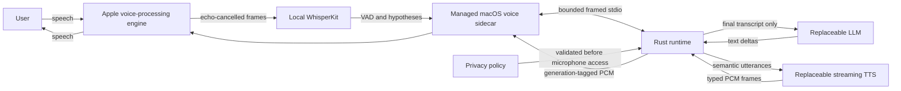
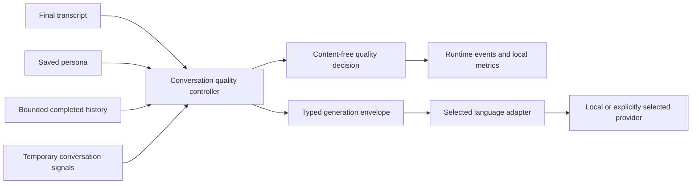
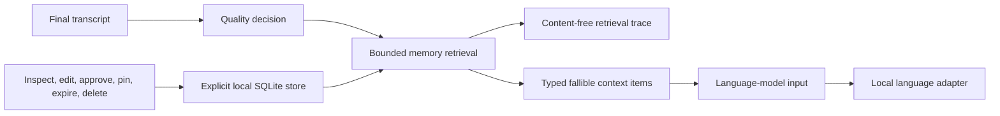

# Architecture

## Dependency Direction

```text
protocol <- model-adapters <- runtime
protocol <- memory         <- runtime
```

`protocol` defines client-visible commands, events, identifiers, and failures. It has no dependency on Tokio, model implementations, or runtime internals.

`model-adapters` defines the capabilities required from language and speech models. Its mock implementations are deterministic test doubles, not deployment backends.

`memory` defines a backend-neutral context-provider boundary and the explicitly
initialized SQLite reference store. It depends on portable protocol types, not
on runtime orchestration or model-specific payloads.

`runtime` owns turn state, adapter coordination, event ordering, and cancellation. Clients should not depend on adapter implementation details.

## R3 Target: Real-Time Voice Loop

R3 keeps the public runtime backend-neutral while adding one managed macOS
platform sidecar for the first full-duplex implementation:



The sidecar owns capture and playback in the same Apple audio engine so built-in
echo cancellation can distinguish user speech from speaker output. It also owns
the first local WhisperKit adapter and the continuous PCM buffer. It binds no
network port.

Before microphone permission or audio-engine startup, the sidecar validates the
absolute local model directory and tokenizer and loads WhisperKit with downloads
disabled. Capture activation follows that recognition preflight; shutdown and
partial-start failures clean up in reverse activation order.

Rust remains authoritative for privacy and adapter validation, session and turn
state, the `600 ms` final-silence rule, generation identifiers, provider
coordination, cancellation, and lifecycle events. Partial transcripts are
observable but never reach the language model. During playback, approximately
the configured `speech_start_ms` of sustained local speech, measured in `100 ms`
VAD windows, flushes the active sidecar generation and cancels language
generation, TTS, queued frames, and playback without waiting for a transcript.
The default remains `200 ms`.

Schema v2 resolves `conversation-voice-sidecar` adjacent to the running
`conversation-voice-loop` binary. `sidecar_executable` is only an optional
absolute override; relative overrides, missing files, and files without an
executable bit fail before capture. Resolution never searches ambient `PATH`.

The session privacy mode and every component's declared local or remote execution
status are immutable after capture begins. `LocalOnly` rejects remote or
undeclared STT, LLM, TTS, tools, memory, and telemetry before microphone access.
There is no silent remote fallback.

See
[the approved R3 design](superpowers/specs/2026-07-28-r3-real-time-voice-loop-design.md)
for the protocol, configuration, failure, testing, and acoustic-measurement
requirements. The deterministic Rust and Swift implementation now follows this
shape. The private local-model/device run and external acoustic recording remain
unperformed, so implementation status does not promote R3 to complete.

## R4 Conversation Quality Layer

R4 inserts one backend-neutral decision layer between finalized input and model
generation:



The saved persona contains visible warmth, humor, teasing, initiative,
directness, intimacy, verbosity, and follow-up-frequency dimensions. The
controller combines that immutable session configuration with explicit mode,
response defaults, at most eight completed exchanges, and current signals. It
resolves spoken-duration, pace, follow-up, and silence behavior before provider
translation.

Corrections are transient. A shorter request, stop-explaining request, rejected
question, hesitation, rapid topic change, or interruption can constrain one
applicable response without changing the saved persona. Cancelled and failed
partial assistant output never enters recent history. Silence creates neither a
turn nor a filler response.

Language adapters receive the same typed envelope: deterministic runtime
guidance, ordered bounded history, current input, resolved controls, and
content-free context sources. An adapter translates those values into its
native message format; it does not own conversation policy. Quality events
expose the decision but never the transcript, prompt, response, provider
payload, or model identifier.

## R5 Controlled Memory Layer

R5 inserts optional bounded retrieval after the quality decision and before
language generation:



The store is absent until an operator calls `initialize` with an absolute path.
Voice startup only opens an existing database. Its enabled `[[memory]]`
descriptor must match one local `[memory_store]`, and language execution must
also be local. The reference runtime does not export memory to remote language
providers and does not fall back silently when configured retrieval fails.

Records carry kind, state, content, provenance, confidence, timestamps,
retention, pin state, revision, last-use metadata, and optional approval
evidence. Identity and relationship content begins as a candidate and requires
a separate confirmation identifier, actor, time, expected revision, and
content digest before activation. Editing approved identity or relationship
content demotes it for reapproval. Working memory expires within 24 hours and
cannot be pinned.

Retrieval uses deterministic multilingual lexical units, skips whole records
that exceed the item or byte budget, and persists selected identifiers and
reasons atomically with a content-free trace. The query is not persisted.
Cancellation waits for blocking SQLite cleanup and commits neither trace nor
last-use metadata after cancellation. Retrieved context is serialized as a
separate message labeled fallible and untrusted; it cannot replace system policy
or directly command relationship behavior.

## Streaming Speech Boundary

Schema-v2 voice configuration selects speech mode explicitly:

```toml
[speech]
mode = "streaming"
streaming_interval = 0.32
```

`streaming_interval` is required only for streaming and must be within
`0.10..=2.00`. `0.32` is the public reference interval, not a backend or model
selection. Buffered compatibility remains available only through
`mode = "buffered"` with no interval. An unsupported streaming endpoint fails
at `SpeechSynthesizer`; the runtime does not retry in buffered mode.

The streaming OpenAI-compatible adapter sends `response_format = "wav"`,
`stream = true`, and the configured interval. HTTP transport chunks are not
media boundaries. The adapter buffers only within the aggregate response limit,
waits for at least 12 RIFF bytes, reads checked `riff_size + 8`, and passes each
complete WAV container to the existing PCM decoder. It rejects redirects, HTTP
failures, stalls, incomplete EOF, oversized declarations, malformed WAV,
aggregate overflow, and format changes. Capacity-one delivery preserves
backpressure, while cancellation can stop request reads and blocked frame sends.
Turn, generation, utterance, and continuous sequence identities remain
unchanged across concatenated containers.

## Runtime Text-to-Audio Flow

1. A client starts one turn with a completed transcript.
   The client sends `RuntimeCommand::StartTurn` through `ConversationRuntime::execute`.
2. The runtime emits `TurnStarted` and `TranscriptFinal`.
3. The language-model adapter streams text deltas.
4. The runtime forwards every delta as lifecycle data and sends the same text through a UTF-8-safe phrase buffer.
5. Completed phrases enter a bounded two-segment queue.
6. One speech worker synthesizes and plays phrases sequentially while language generation continues.
7. The runtime emits `SpeechCompleted` after the queue drains and exactly one terminal event after owned cleanup.

ASR begins in the feasibility and voice-loop milestones. Starting the deterministic seam at a completed transcript isolates orchestration behavior from microphone and model availability.

## Media and Lifecycle Paths

Lifecycle and media use separate paths:

```text
language deltas
  ├─> bounded RuntimeEvent stream ─> client lifecycle observer
  └─> phrase buffer ─> bounded phrase queue ─> SpeechSynthesizer
                                               └─> typed audio ─> AudioOutput
```

`SpeechSynthesizer` returns validated typed audio. `AudioOutput` receives an `AudioOutputRequest` containing the turn identifier, segment index, and owned audio. Encoded audio moves directly between these adapter boundaries; it never enters `conversation-protocol` or the lifecycle event channel.

`AudioOutput` resolves only after playback completes or after all output-owned process and temporary-file cleanup completes. The runtime can therefore coordinate generation, synthesis, queued phrases, and active output through one cancellation path without coupling public lifecycle types to audio bytes or a platform player.

Runtime timing events share one monotonic origin captured at `TurnStarted`:

- `FirstTextDelta` is observed immediately before the first text delta;
- `FirstSynthesisRequest` is observed immediately before the first speech-adapter call;
- `FirstPlayableAudio` is timestamped after typed-audio validation and before lifecycle publication and output handoff. It causally precedes the first output-adapter call.

First playable audio means validated encoded bytes are ready for output. It is not a claim that an output process has launched or that a physical speaker has become audible.

The real-time loop adds sidecar acceptance, render acknowledgement, barge-in
onset/threshold, flush acknowledgement, queue depth, underrun count, and cleanup
metrics on the same content-free evidence boundary. These meanings stay
separate:

- first playable: Rust has a validated PCM frame;
- first sidecar accept: the sidecar accepted generation-tagged PCM;
- render acknowledgement: the audio engine reported rendering progress;
- first audible: an external recording observes speaker output;
- audible stop: an external recording observes the interrupted response end.

Neither sidecar acceptance nor render acknowledgement is acoustic evidence.

## Runtime Invariants

- A runtime instance owns at most one active turn.
- Clients assign strictly increasing turn identifiers per runtime instance.
- Every observed turn ends with exactly one of `TurnCompleted`, `TurnCancelled`, or `TurnFailed`.
- Interruption cancels the active token shared with downstream adapter work.
- Events from an interrupted turn retain their `TurnId` and cannot become events for a later turn.
- Adapter errors cross the runtime boundary with their failing stage intact.

## Cancellation

The runtime uses a cancellation token for the active turn and child tokens for adapter calls. Language streaming races event work against cancellation. Speech implementations must observe their child token and resolve only after owned cleanup completes; the runtime awaits that cleanup before publishing terminal cancellation. A non-cooperative third-party speech implementation can therefore delay cancellation.

`TurnEventStream` hides the transport implementation from SDK consumers. Nonterminal lifecycle data uses a bounded channel with cancellation-aware sends, while the terminal event uses an independent one-shot channel. An undrained client therefore applies bounded backpressure without preventing interruption from finalizing the turn.

Terminal selection, publication, and removal of the active turn are serialized by the active-turn lock: if interruption returns accepted, that turn cannot later complete successfully. Real high-rate partial transcripts or audio require explicit aggregation or a separate media transport; lifecycle finalization remains independent of consumer backpressure.

The macOS real-time path adopts the same generation token and has deterministic
capture, recognition, queue, playback flush, cleanup, and stale-generation
coverage. Physical microphone behavior, echo rejection, first audible output,
and audible stop still require the separate process/device and acoustic
procedures.

The streaming speech adapter treats receiver closure like explicit
cancellation while awaiting request headers or body chunks and while decoding
selected WAV containers. Cancellation checks precede PCM/frame allocations and
run during chunk and frame processing, so a dropped consumer does not leave an
HTTP producer or full-container decode running without an owner.

The process/device harness securely opens each metrics-parent path component
with no-follow directory descriptors, checks ownership and permissions, rejects
repository ancestry, and retains the parent ancestry needed to revalidate the
path. Metrics are written through one exclusively created `0600` descriptor
inside a private `0700` staging directory. Before readiness, the helper
registers vnode monitoring on the output parent, staging directory, and output
file; watched link, rename, delete, or revoke events fail the run. After EOF,
the helper revalidates the parent and publishes the complete file with an
exclusive descriptor-relative rename. Failed cleanup removes a public leaf
only when its reopened type, device, inode, and link count match the expected
file, so an unrelated replacement is left untouched and reported. No sensitive
writes occur through the public target pathname.

The measured-command launcher creates a new session and reports its PID, PGID,
and SID from inside that session before it can exec the command. The parent
requires `PID == PGID == SID`, requires that identity to equal the launcher
child, and verifies it with the kernel before releasing execution. A guardian
keeps the verified session leader alive until cleanup. Every group TERM/KILL is
preceded by another kernel identity check; failed or timed-out handshakes clean
only the known child PID. The parent reaps the launcher and boundedly verifies
that the group is empty without using PID ancestry as cleanup authority.
Status-report failures retain the guardian and verified identity until the
parent explicitly acknowledges cleanup or signals the verified group.

### Acceptance Harness Threat Boundary

The harness assumes a trusted local operator account. It protects against
accidental overwrite, symbolic links and special files, unsafe output
permissions, repository output, ordinary child leaks, timeout/SIGINT, and
descendants created by the controlled CLI and sidecar.

It is not a security boundary against a malicious same-EUID process racing
namespaces, hard links, or mounts. Descriptor monitoring begins only after each
relevant object can be opened and registered, so pre-registration races and
mount-namespace substitution remain outside its guarantee. Retaining
descriptors detects controlled path identity changes but does not make the
filesystem namespace race-proof.

Process cleanup similarly relies on verified numeric PID, PGID, and SID
identity while the guardian remains alive. Deterministic fixtures verify that
controlled conversation-runtime descendants retain that group and session,
and identity is revalidated before every signal. A measured descendant that
intentionally calls `setpgid` or `setsid` can escape supervision. The harness
does not claim containment of a malicious measured command.

## macOS System-Speech Reference

`MacOsSystemSpeechSynthesizer` implements `SpeechSynthesizer` without changing protocol types. Its public configuration types compile across supported development platforms, while `/usr/bin/say` and `/usr/bin/afplay` defaults are macOS-gated.

The adapter invokes the configured executable directly, bounds text, audio, and captured error output, returns typed AIFF bytes, kills and awaits cancelled child processes, and removes temporary synthesis files on every path. `conversation-tts-probe` owns explicit output persistence and playback; neither operating-system commands nor audio bytes enter `conversation-protocol`.

`MacOsAfplayAudioOutput` is the separate runtime output reference. It directly invokes a configured absolute executable without a shell, accepts validated WAV or AIFF, writes one bounded temporary file per segment, kills and awaits active playback on cancellation, bounds captured error output, and removes temporary files on every path. The generic `AudioOutput` contract does not select a platform player, speaker, voice, or application routing policy.

## Relationship Behavior

Model relationships through context and conversation state rather than fixed scripts. Earned behavior is often more memorable than configurable behavior.

Affectionate expressions, special moments, and relationship signals must emerge from shared context, pacing, reciprocity, and rapport. They are not triggered by canned sequences, invisible unlock flags, frequency quotas, or a durable memory record that directly commands an expression. Persona and memory may shape the context available to the response controller, but the current conversational state remains authoritative.

## Public Repository Boundary

The public SDK defines portable contracts, reference adapters, reproducible evaluation methods, and clearly labeled historical measurements. It does not encode an application's models, voices, routing thresholds, personas, or deployment policy.

Exact checkpoint identifiers may appear only when required to reproduce benchmark evidence. They are measurements, not endorsements. Public examples use generic identifiers, while application configuration and deployment decisions remain outside this repository.

Desktop controls, authenticated iPhone/LAN access, Linux and Windows media
implementations, encrypted application storage, semantic retrieval, and
cloud/provider memory export remain deferred boundaries. The deterministic
macOS and SQLite reference paths do not imply those platform or deployment
capabilities.

## Why the Desktop Shell Is Deferred

Creating the Tauri and React application before runtime contracts exist would couple the first protocol to desktop UI needs. The current boundary is documentation-only until deterministic turn and cancellation tests pass and feasibility benchmarks validate concrete reference adapters.
