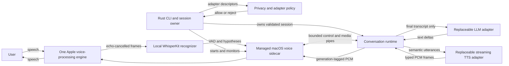

# R3 Real-Time Voice Loop and Barge-In Design

## Status

Approved design for the first R3 implementation slice. This document specifies
the target architecture and acceptance boundary; it does not claim that
microphone capture, ASR, continuous playback, acoustic latency measurement, or
barge-in are already implemented.

## User Problem

The current runtime can turn completed typed text into local speech, but the user
must still operate each turn manually. Playback uses complete encoded files and
cannot distinguish the user's voice from speaker echo. The next testable version
must sustain a private hands-free conversation, show what it heard, finalize
turns predictably, and stop speaking when the user interrupts.

The runtime must solve this without making one model, provider, voice, or
application the product. Local execution is the default privacy posture, while
remote adapters remain explicit, independently replaceable choices.

## Goals

- Capture the system-default microphone and play through the system-default
  output on macOS Apple Silicon.
- Run local voice activity detection and local WhisperKit speech recognition.
- Publish partial transcripts immediately without sending them to the language
  model.
- Finalize one user turn after approximately `600 ms` of silence.
- Detect sustained user speech during playback after approximately `200 ms`,
  stop audible output, and cancel all work from the interrupted generation.
- Stream typed audio into one continuous playback engine rather than launching a
  player for every sentence.
- Enforce local-only, hybrid, and cloud privacy policies before microphone
  access.
- Measure speech-end to first playable audio and measure first audible audio
  acoustically.

## Non-Goals

- Desktop or mobile graphical applications.
- iPhone or LAN clients.
- Windows or Linux audio implementations.
- Durable SQLite conversation history.
- Voice cloning or selecting a deployment model for SDK consumers.
- Operational cloud-provider integrations beyond the neutral adapter and policy
  contracts.
- Perfect suppression of every false VAD trigger or every long-form TTS tone
  variation.

Those capabilities remain roadmap work after the macOS command-line slice proves
the contracts.

## Approaches Considered

### Keep capture, recognition, and playback in Rust

Rust would own every runtime component directly. This gives one implementation
language, but Apple voice processing requires input and output to participate in
the same platform audio engine. Reimplementing the Apple audio session and
WhisperKit integration through low-level foreign-function bindings would add
risk without improving the public SDK boundary.

### Run independent capture, ASR, and playback processes

Separate processes are easy to prototype, but they cannot reliably share the
single Apple voice-processing graph required for acoustic echo cancellation.
Process-per-utterance playback also preserves the pauses and voice resets that
R3 is intended to remove.

### Managed local sidecar

A bundled Swift sidecar owns the Apple full-duplex audio engine, local
WhisperKit integration, and continuous PCM playback. The Rust CLI starts the
sidecar as a child process and communicates over bounded framed child pipes:
standard input is reserved for control, while an inherited local file descriptor
carries parent-to-child PCM. Rust remains authoritative for privacy policy,
session state, turn finalization, provider coordination, cancellation, and
public events.

This is the selected approach. The sidecar is a replaceable platform adapter,
not a network service or a second product.

## Target Architecture



The sidecar owns both capture and playback because Apple voice processing and
echo cancellation require them to share one audio engine. It binds no network
port. Rust owns every provider connection and never infers privacy from an
endpoint being loopback.

## Component Responsibilities

### Rust session owner

- Loads and validates the complete configuration before microphone access.
- Resolves the privacy mode and every adapter's declared execution location.
- Starts, monitors, and shuts down the sidecar child process.
- Captures the system-default device choice once per session.
- Owns the authoritative session, turn, utterance, and generation identifiers.
- Applies the `600 ms` final-silence rule and sends only finalized transcripts
  to the language model.
- Cancels language generation, TTS, queued frames, and sidecar playback after a
  barge-in event.
- Publishes lifecycle events and bounded, content-free operational metrics.

### Managed macOS sidecar

- Opens one full-duplex Apple voice-processing audio engine.
- Uses the system-default input and output selected when the session starts.
- Applies Apple's built-in acoustic echo cancellation; headphones are not
  required.
- Runs local VAD and WhisperKit/Core ML recognition.
- Emits speech activity, partial hypotheses, recognizer-final hypotheses, device
  failures, and playback acknowledgements.
- Accepts generation-tagged PCM frames into a bounded continuous playback
  buffer.
- Immediately flushes playback for the interrupted generation when local speech
  satisfies the `200 ms` barge-in threshold.
- Rejects stale generations and never resumes flushed audio.

### Replaceable adapters

- `SpeechRecognizer` exposes speech hypotheses and recognition failures without
  owning turn finalization policy.
- `LanguageModel` consumes finalized text only.
- `StreamingSpeechSynthesizer` converts one semantic utterance into validated
  typed audio frames.
- `AudioCapture` and continuous `AudioOutput` contracts isolate platform audio
  from runtime orchestration.

WhisperKit is the first macOS recognizer implementation. A whisper.cpp adapter is
deferred for future Linux and Windows work. These are reference implementation
choices, not public SDK model recommendations.

## Privacy and Provider Boundary

Conversation Runtime is local-first and backend-neutral.

The default private path is:

```text
Microphone -> Local STT -> Local LLM -> Local TTS -> Speaker
```

The session declares one immutable privacy mode:

- `LocalOnly`: all STT, LLM, TTS, tools, memory, and telemetry adapters must
  declare local execution.
- `Hybrid`: the enabled primary STT, LLM, and TTS set contains at least one
  local component and at least one remote component.
- `Cloud`: every enabled primary STT, LLM, and TTS component declares remote
  execution; tools, memory, and telemetry remain independently declared.

Every adapter provides a descriptor containing its component kind, execution
location, and provider identifier. Locality is never inferred from a URL,
hostname, process name, or model name.

Before the sidecar is started or microphone permission is requested, policy
validation must:

1. inspect all configured adapters, tools, memory stores, and telemetry sinks;
2. reject every remote descriptor in `LocalOnly`;
3. reject any component whose location is undeclared;
4. produce the complete session privacy summary shown to the client.

There is no silent fallback from a local adapter to a remote adapter. A failed
local component fails the session or turn at its typed stage.

Enabling a remote component changes the visible session privacy status and
requires explicit user selection or consent:

- cloud STT discloses that microphone audio leaves the device;
- cloud LLM discloses that transcripts, prompts, context, and tool data may
  leave the device;
- cloud TTS discloses that generated response text leaves the device.

Sensitive audio, transcript, prompt, context, and response content is excluded
from telemetry by default. Enterprise policy may prohibit all remote adapters.

Changing privacy mode, adapter locality, provider, sidecar executable, or device
selection requires a new session.

## Session and Device Lifecycle

The command-line application defaults to the macOS system-default input and
output. It resolves those devices when a voice session starts and keeps them
stable for that session. A user changing the macOS default device affects the
next session, not the active one.

Session startup is ordered:

1. parse the bounded private configuration;
2. construct every adapter descriptor;
3. enforce privacy and enterprise policy;
4. validate local model and sidecar availability;
5. start the sidecar;
6. request microphone permission and open the audio engine;
7. publish the active component locality summary;
8. begin capture.

If any step fails, later steps do not run. In particular, invalid `LocalOnly`
configuration cannot open the microphone.

The CLI owns the child lifecycle. Unexpected sidecar exit terminates the active
voice session after cleanup. It does not silently restart because a restarted
audio engine could change devices, permissions, and recognition state. The user
may start a new session explicitly.

## Child-Process Protocol

The initial macOS transport is a private child-process protocol with independent
control and media paths:

- parent-to-child control messages use standard input;
- parent-to-child PCM frames use inherited local file descriptor `3`;
- child-to-parent events and acknowledgements use standard output;
- diagnostics use bounded standard error;
- each frame starts with an eight-byte big-endian header: unsigned
  `version: u16`, `kind: u16`, and `payload_length: u32`;
- protocol version one is the only accepted initial version;
- control payloads are UTF-8 JSON bounded to `64 KiB`;
- audio payloads contain `48` bytes of metadata plus interleaved PCM; PCM sample
  bytes are bounded to `64 KiB`, so the complete audio payload is bounded to
  `65,584` bytes;
- captured diagnostics retain at most `64 KiB` for one sidecar process;
- unknown versions, kinds, invalid lengths, malformed JSON, and invalid audio
  metadata fail the session;
- the parent-to-child media queue holds at most `100` frames or two seconds of
  negotiated PCM, whichever limit is reached first;
- control and cancellation messages use standard input and cannot be blocked by
  an in-flight write on the independent PCM descriptor;
- EOF is a sidecar failure unless shutdown was requested.

The protocol carries session, turn, utterance, and generation identifiers where
applicable. Identifier mismatch is an error; an older generation is discarded
as stale. Standard output contains protocol frames only so model or diagnostic
text cannot corrupt framing.

These version-one values are constants with fixture tests. They are private
interoperability details, not public Rust API commitments.

## Public Contracts

R3 adds or extends neutral contracts for:

- `AudioFrame`: validated PCM bytes plus sample rate, channel count, sample
  format, frame sequence, and generation identity;
- `AudioCapture`: starts a session-scoped frame/event stream and resolves only
  after owned cleanup;
- `SpeechRecognizer`: accepts or owns capture frames and emits bounded
  hypotheses;
- `VoiceActivity`: speech-start, speech-continue, and speech-end observations
  with monotonic timing;
- `VoiceSessionPolicy`: immutable privacy mode, component descriptors, and turn
  thresholds;
- `VoiceSessionEvent`: partial transcript, final transcript, privacy summary,
  barge-in, playback state, timing, and typed failure events.

High-rate audio remains outside the lifecycle event channel. The event channel
carries state and timing; the media path uses separately bounded frame streams.

Public enums remain non-exhaustive. Existing typed-turn APIs continue to work,
and complete encoded `SpeechSynthesizer`/`AudioOutput` adapters remain available
for non-real-time use. The real-time loop uses streaming contracts rather than
changing complete-file semantics in place.

## Recognition and Turn Finalization

The sidecar emits:

- local VAD observations;
- partial WhisperKit hypotheses suitable for immediate display;
- recognizer-final hypotheses when WhisperKit stabilizes a segment.

Rust owns conversational finalization. A recognizer-final result updates the
current candidate but does not bypass the silence policy. After approximately
`600 ms` without detected speech, Rust publishes one final transcript and starts
one runtime turn. Empty or whitespace-only candidates do not start a turn.

Partial transcripts are observable but are never sent to the language model,
tools, memory, or TTS. A later hypothesis replaces the displayed partial for the
same capture segment; it is not appended as a second user message.

The `600 ms` duration is session configuration validated within a safe bounded
range. It is immutable after capture begins.

## Barge-In and Generation Safety

When output is active, the sidecar evaluates echo-cancelled microphone frames.
After approximately `200 ms` of continuous local speech:

1. the sidecar flushes queued and active PCM for the current generation;
2. it emits a barge-in event tagged with that generation;
3. Rust cancels the shared turn token;
4. language generation, active TTS, pending utterances, frame producers, and
   runtime queues stop and clean up;
5. the interrupted turn publishes exactly one terminal cancellation event;
6. capture continues for the user's new utterance.

Barge-in does not wait for ASR text. Speaker echo alone must not trigger it under
the supported Apple voice-processing path.

Each assistant response receives a monotonically increasing generation
identifier. Every language-model request and delta, TTS request, audio frame,
queue item, playback command, and acknowledgement carries the turn and
generation identity internally. Before publishing a model delta or accepting a
media item, Rust confirms that both identities still match the active
generation. Rust and the sidecar independently reject work from cancelled or
older generations. This prevents stale audio or text from appearing in the next
turn even if an adapter completes late.

The `200 ms` duration is session configuration validated within a safe bounded
range. It is immutable after capture begins.

## Continuous Synthesis and Playback

The sidecar keeps one audio engine and one output node alive for the full
session. It does not launch a playback process per sentence.

The runtime continues to emit original model text unchanged. Speech-only
normalization removes supported Markdown formatting while preserving literal
content. The utterance assembler then:

- sends a short answer as one synthesis request;
- normally divides a longer answer into two or three semantic sections;
- prefers paragraph, heading, and safe phrase boundaries;
- retains an absolute UTF-8-safe hard limit;
- never waits for the complete response when an eligible first section is
  ready.

A streaming TTS adapter yields validated `AudioFrame` values. Rust sends those
frames to the sidecar through a bounded queue. The sidecar converts or rejects
unsupported formats before the session starts; the active stream uses one
negotiated PCM format. Playback remains ordered by utterance and frame sequence.

The bounded queue applies backpressure to TTS. Queue overflow, sequence gaps,
format changes, and malformed frames fail explicitly rather than dropping
unknown audio. Cancellation remains out-of-band so a full media queue cannot
block barge-in.

One continuous engine removes process-launch gaps and should reduce audible
seams. It cannot guarantee identical tone across independently synthesized
long-form utterances; the first slice reduces request count rather than claiming
perfect voice-state continuity.

## Configuration Schema

R3 introduces private voice configuration schema version `2`. A minimal
local-only example is:

```toml
schema_version = 2

[privacy]
mode = "local-only"

[capture]
device = "system-default"

[turn]
speech_start_ms = 200
final_silence_ms = 600

[asr]
backend = "whisperkit"
execution = "local"

[language]
backend = "replaceable-local-adapter"
execution = "local"

[speech]
backend = "replaceable-local-adapter"
execution = "local"

[audio]
backend = "managed-sidecar"
execution = "local"
```

Concrete model identifiers, voices, endpoints, executable overrides, and secrets
belong in the user's private file outside the repository. Public examples use
generic placeholders.

The bundled sidecar is the default. An absolute executable override is allowed
for development and packaging tests. Relative executable paths and ambient
`PATH` lookup are rejected.

Schema version `1` remains valid for the existing typed-input probe. It is not
silently interpreted as a real-time voice-session configuration. A schema
version `2` migration path may reuse provider-specific fields, but every
component must add an explicit execution declaration.

## Failures and Recovery

Failures identify their stage and do not silently switch provider or privacy
mode:

- microphone permission denied;
- input or output device unavailable;
- local ASR model missing or incompatible;
- sidecar executable missing, malformed, or unexpectedly exited;
- child frame malformed, oversized, out of sequence, or stale;
- media or lifecycle queue overflow;
- language or TTS adapter failure;
- playback engine or audio-format negotiation failure;
- cleanup timeout.

An active-turn failure publishes exactly one terminal event after owned cleanup.
A recoverable turn failure leaves the still-valid session ready for another
turn. A sidecar, device, permission, framing, or policy failure ends the session
and requires a new one.

No transcript or audio content is included in default error strings. Bounded
diagnostic capture prevents a failed child or provider from exhausting memory.

## Metrics and Evidence

All runtime timings use one monotonic session clock. R3 records:

- physical speech-end marker used by the deterministic harness;
- transcript finalization;
- first text delta;
- first synthesis request;
- first validated playable frame;
- first frame accepted by the sidecar;
- playback render acknowledgement;
- barge-in speech onset and threshold crossing;
- playback flush acknowledgement;
- synthesis duration, queue depth, underruns, cancellation duration, and cleanup.

`FirstPlayableAudio` means a validated audio frame is ready. A render callback or
player launch is not evidence of physical sound.

First audible and stop-audible latency require an external acoustic or loopback
measurement that observes speaker output. Repository evidence must label
deterministic runtime timing, process/device timing, and acoustic timing
separately.

Sensitive content is excluded from metrics and logs by default. Identifiers,
durations, counts, stages, queue depths, and locality descriptors are sufficient
for the initial evaluation.

## Verification Strategy

### Deterministic contract tests

- `LocalOnly` rejects every remote or undeclared STT, LLM, TTS, tool, memory,
  and telemetry adapter before capture.
- Hybrid and cloud sessions expose the exact component locality summary.
- Device and privacy configuration cannot change inside an active session.
- Partial transcripts publish immediately but never invoke the language model.
- The latest candidate finalizes once after `600 ms` silence.
- Sustained speech during playback triggers barge-in after `200 ms` without
  waiting for transcript text.
- Cancellation reaches generation, synthesis, frame queues, and playback.
- Stale generation frames are rejected before playback.
- Sidecar crash, malformed frames, blocked output, permission denial, dropped
  consumers, and queue overflow resolve with typed failures and cleanup.
- Terminal publication remains exactly once under completion, cancellation, and
  failure races.

### Protocol and sidecar tests

- Golden fixtures cover every version-one control and audio frame.
- Fuzz/property tests reject invalid lengths, unknown kinds, invalid UTF-8,
  unsupported PCM, sequence gaps, and truncated EOF.
- A fake sidecar deterministically simulates slow reads, blocked media writes,
  control delivery during a blocked media write, out-of-order acknowledgements,
  crashes, and stale playback.
- A sidecar harness verifies default-device capture, full-duplex playback,
  engine shutdown, and microphone permission behavior without cloud services.

### Local Apple Silicon acceptance

- Sustain a ten-minute local-only conversation without manual pipeline reset.
- Interrupt repeatedly during generation and playback without stale text or
  audio entering the next turn.
- Verify that ordinary speaker output does not trigger barge-in under the Apple
  voice-processing path.
- Measure physical speech onset to audible stop at `<= 500 ms` p95 over the
  scripted barge-in set.
- Measure speech end to first playable and first audible response over a
  representative multilingual scripted set.
- Record underruns and audible seams; report listening observations separately
  from deterministic results.
- Confirm that packet captures and content-log scans show no remote traffic or
  sensitive transcript/audio persistence in `LocalOnly`.

Passing Rust tests or observing a playback render callback is not sufficient for
the acoustic acceptance claims.

## First Implementation Slice

The first testable R3 slice is intentionally narrow:

- macOS Apple Silicon;
- command-line session;
- system-default microphone and output;
- managed Swift sidecar with Apple voice processing;
- local WhisperKit recognition;
- replaceable local language and streaming speech adapters;
- partial and final transcript events;
- `200 ms` barge-in and `600 ms` finalization defaults;
- continuous generation-tagged PCM playback;
- local-only policy enforcement;
- deterministic fake-sidecar coverage and measured local acceptance harness.

The first slice may be implemented in vertical increments, but it is not R3
complete until the ten-minute and acoustic barge-in acceptance checks are
recorded.

## Deferred Roadmap

- Desktop application controls and visible privacy indicators.
- iPhone client and authenticated LAN session transport.
- Linux and Windows capture/playback implementations, with whisper.cpp as an ASR
  candidate.
- SQLite conversation history and retention controls.
- Operational cloud STT, LLM, and TTS adapters with consent UX.
- Stateful neural-TTS sessions for stronger long-form voice consistency.

The public contracts and privacy policy must remain portable across those later
implementations.

## Success Criteria

- A user can start one local-only CLI session and converse hands-free for ten
  minutes.
- Partial text appears promptly, but only finalized text reaches the language
  model.
- User speech during playback stops audible output within the measured bound and
  cancels all downstream work.
- No cancelled generation can publish stale text or play stale audio.
- First playable and first audible timings are reported as distinct evidence.
- Every component's local or remote status is explicit and visible.
- No remote adapter or fallback can run in `LocalOnly`.
- Failures preserve typed stage, bounded resources, exactly one terminal event,
  and a clear session-recovery rule.
- Existing typed-input APIs and deterministic R2 behavior continue to pass.
