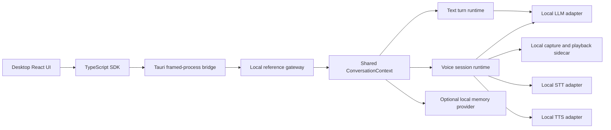

# R6 Desktop Voice Session Design

**Status:** Approved for implementation planning  
**Date:** 2026-08-06  
**Milestone:** R6 — Desktop Reference App and SDK Boundary

## Problem

The repository already contains a local real-time voice runtime, managed macOS
voice sidecar, barge-in behavior, streaming speech, a local text gateway, a
public TypeScript SDK, and a desktop Voice Focus scene. These pieces are not yet
connected through one public application boundary. Voice Focus is therefore a
visual preview rather than a real conversation mode, and the existing text
gateway and voice-loop probe own separate conversation state.

The user needs one explicit, private voice session that shares real model
context with typed chat. Showing spoken and typed turns in one transcript is
not sufficient if the runtimes still hold separate bounded histories, persona
state, identifiers, or memory retrieval context.

## Goals

- Add a production desktop voice session through public Rust and TypeScript SDK
  contracts.
- Require an explicit **Start voice** action before microphone access.
- Use one local gateway process and one shared conversation context for typed
  and spoken turns.
- Preserve the existing local-first provider boundary and prohibit silent
  remote fallback.
- Connect real microphone capture, local recognition, local language
  generation, local speech synthesis, playback, and barge-in to Voice Focus.
- Let a user leave Voice Focus while deciding whether to stop voice, keep voice
  active in Conversation, or cancel the exit.
- Pause microphone capture while the user types, process the typed turn through
  the same context, and resume capture after the typed turn reaches a terminal
  event when the same voice session remains active and the user has not stopped
  it.
- Keep the repository, protocol, examples, and documentation backend-neutral.
- Produce deterministic cross-language and desktop tests plus an explicit
  native human-verification boundary.

## Non-Goals

- Cloud voice adapters or remote fallback.
- Automatic model or voice-model downloads.
- LAN or iPhone transport; those remain R7 work.
- Persona or memory mutation UI.
- Automatic transcript-to-memory extraction.
- Audio recording, audio-history storage, or transcript telemetry.
- Packaging model weights inside the desktop application.
- Completing R3 human-spoken, ten-minute, first-audible, or 30-sample acoustic
  acceptance through automated UI tests alone.
- Supporting simultaneous microphone capture and typed input.

## Selected Architecture

The existing local gateway becomes the reference host for both typed and voice
sessions. It remains a child process connected through bounded framed stdio and
does not open a network listener. The Tauri bridge remains a generic process
and frame bridge. React never opens the microphone, reads model files, invokes
provider endpoints, or opens the runtime memory database directly.

The runtime SDK gains a shared `ConversationContext`. Both the text-turn runtime
and voice-session runtime consume this context. It owns:

- the bounded completed-turn history used for language-model input;
- persona and conversation-quality state;
- monotonic turn and generation identifier allocation;
- the configured local memory-context provider;
- the single-active-turn arbitration required across typed and spoken input.

The shared context is a Rust SDK concept, not a gateway, Tauri, React, Ollama,
or macOS-specific type. The gateway demonstrates one composition of the public
contracts.



## SDK Boundary

The implementation preserves five distinct layers:

1. `conversation-protocol` defines backend-neutral commands, events, privacy
   descriptors, errors, limits, and identifiers.
2. `conversation-runtime` owns shared context and typed/voice lifecycle rules.
3. Model-adapter crates implement replaceable STT, LLM, TTS, audio, and memory
   seams.
4. `@conversation/runtime` validates and correlates the public protocol without
   importing Node or desktop application code from its browser entry.
5. The gateway and desktop are reference applications that consume the SDK
   boundary rather than defining it.

STT, LLM, TTS, audio I/O, memory, tools, and telemetry remain independently
described components. The first reference configuration is local-only, but the
core interfaces do not hardcode a private model, provider, venture, or product
deployment.

## Public Protocol Version 3

Voice lifecycle and gateway-owned turn sequencing require a protocol-version
advance. Version 1, version 2, and version 3 reject one another rather than
silently negotiating incompatible commands or status fields.

### Commands

Protocol v3 supports:

```text
status(request_id)
start_turn(request_id, transcript)
interrupt_turn(request_id, turn_id)
start_voice_session(request_id)
stop_voice_session(request_id)
pause_voice_capture(request_id)
resume_voice_capture(request_id)
memory_list(request_id, cursor)
memory_inspect(request_id, memory_id)
```

The gateway allocates turn and generation identifiers for typed and spoken
turns. `start_turn` no longer accepts a client-selected turn identifier. A
correlated typed `turn_started` event includes the originating `request_id` and
the allocated `turn_id`; voice-originated turns have no client request ID.
This removes the race in which a client and the microphone could allocate the
same next identifier.

All control commands receive exactly one correlated acceptance or rejection.
Acceptance confirms ownership of the operation, not lifecycle completion.
Session and turn events remain the authority for completion.

### Runtime Status

Status continues to expose transport, privacy mode, language location, model
identifier, memory state, telemetry state, and capabilities. Protocol v3 adds
the validated component descriptors required for a truthful privacy display.

The supported capability order is strict and canonical:

```text
text
memory_inspection (when configured)
voice_session (when configured)
```

`voice_session` is advertised only when the optional voice configuration is
valid and every required local adapter can be constructed without opening the
microphone. Microphone permission and device availability are checked only
after the explicit start command and may still produce a typed start failure.

Status component descriptors include component kind, execution location, and a
bounded user-facing provider label. They never include credentials, endpoint
queries, transcripts, prompts, memory contents, model paths, or audio-device
data.

### Voice Events

The v3 wire contract projects the existing Rust voice lifecycle without
flattening it into UI-specific states:

```text
voice_session_started
voice_activity
voice_transcript_partial
voice_transcript_final
voice_barge_in
voice_turn_event
voice_timing
voice_playback
voice_session_failed
voice_session_ended
voice_capture_paused
voice_capture_resumed
```

Every event carries the voice session identifier. Turn, generation, segment,
and timing identifiers use bounded canonical decimal strings and become
`bigint` in TypeScript. Partial transcripts are best-effort and replace the
previous partial for the same segment. Final transcripts, barge-in, turn
terminals, session failures, pause/resume acknowledgements, and session end are
reliable and ordered.

Recoverable session failures carry `continue_session`; terminal failures carry
`new_session`. The SDK exposes typed error codes and stages rather than making
clients inspect diagnostic text.

## Shared Conversation Semantics

Only completed exchanges enter bounded language-model history. A spoken final
transcript starts a normal shared turn, and its assistant text deltas and
terminal event update the same desktop turn model and local transcript history
as typed input.

Partial recognition text is visible only as transient UI state. It is not
stored in conversation history, semantic memory, logs, or telemetry.

The shared context enforces one active generation across both input modes:

- A typed turn cannot begin until voice capture is confirmed paused and any
  prior voice turn is terminal.
- A voice final cannot begin a new turn while a typed turn is active.
- User speech during voice playback invokes the existing barge-in path, which
  cancels generation and synthesis, flushes queued and active audio, waits for
  cleanup, and then permits replacement work.
- An interrupted or failed partial exchange is discarded from model history.
- Runtime memory retrieval uses the same provider and declared budget for both
  input modes.

The context survives stopping and restarting a voice session while the gateway
process remains connected. Stopping voice therefore does not create a new text
conversation or discard completed context.

## Configuration

The reference gateway configuration advances from schema version 1 to schema
version 2. Language, persona, memory, privacy, and telemetry remain single
shared sections. An optional `[voice]` subtree adds only voice-specific
configuration:

- capture device selection;
- speech-start and final-silence thresholds;
- local ASR adapter and model path;
- local TTS adapter, voice, language, and bounded generation controls;
- managed local audio sidecar and bounded diagnostic limits.

The voice subtree must not repeat language-model, persona, or memory settings.
The gateway composes voice adapters with the same language model, quality
controller, and memory provider used by text turns.

Without `[voice]`, the gateway remains a valid text and optional-memory runtime
and does not advertise `voice_session`. Invalid voice configuration fails
gateway startup rather than silently disabling requested voice or falling back
to a remote component.

The gateway loads configuration and validates absolute paths before accepting a
client. It does not access microphone hardware, start the voice sidecar, or
contact STT/TTS services until `start_voice_session` is accepted.

## Desktop Experience

When the gateway does not advertise `voice_session`, the existing visual-only
preview remains available and clearly labeled. When voice is configured, the
workspace offers `Voice Focus` and opens the scene in an idle state with a
prominent **Start voice** control.

Entering Voice Focus never starts capture. The previous automatic-entry
preference is migrated to manual entry because it conflicts with explicit
microphone consent.

After start:

- the privacy status remains visible;
- the visual state maps to requesting permission, listening, thinking,
  speaking, interrupted, paused, or error;
- the transcript remains hidden by default and can be revealed explicitly;
- a persistent microphone indicator is visible whenever capture is active;
- Stop voice remains available without opening secondary controls.

### Leaving Voice Focus

Leaving an idle or stopped scene returns directly to Conversation. Leaving
while voice is active opens an accessible confirmation dialog with exactly
three actions:

1. **Stop voice and exit** — shut down capture and playback, await the terminal
   voice event, then return to Conversation.
2. **Keep voice running in Conversation** — leave the immersive scene while
   retaining the active voice session.
3. **Cancel** — close the dialog and remain in Voice Focus.

`Escape` opens the same confirmation while voice is active; it does not bypass
the decision. The UI never claims voice stopped until the terminal event is
observed.

### Voice in Conversation View

When voice continues outside Focus, Conversation shows a persistent local
microphone indicator, current voice state, a return-to-Focus action, and Stop
voice. Hidden background listening is not allowed.

Focusing the typed composer requests `pause_voice_capture`. The microphone
indicator remains active until `voice_capture_paused` is observed. Typed send
is enabled only after pause acknowledgement. After the typed turn reaches a
terminal event, the client requests `resume_voice_capture` if the same voice
session is still active and the user has not selected Stop voice. If the
composer contains an unsent draft, voice remains paused until the draft is sent
or cleared. Clearing the draft and leaving the composer resumes capture when
the same voice session is active. The UI visibly reports every transition.

Pause means the audio engine stops capture. Dropping recognition events while
the microphone remains active does not satisfy this contract.

## Error Handling

Voice failures never silently switch providers or locations.

- Permission denial, missing input device, recoverable recognition failure, or
  recoverable synthesis failure stops or pauses voice as directed by the Rust
  recovery disposition and leaves typed chat available.
- A recoverable voice error shows a content-free stage-specific explanation
  and an explicit Retry action.
- A terminal voice-session error requires a new explicit Start voice action but
  does not discard completed conversation context.
- A gateway framing, process, or invariant failure closes the client session
  and returns the desktop to setup.
- A failed pause keeps typed send disabled until the user stops voice or capture
  is confirmed paused.
- A failed resume leaves voice visibly paused and offers Retry or Stop.
- Closing the desktop or gateway cancels active generation, synthesis, queued
  audio, capture, and sidecar work; it waits for process reaping before
  reporting closure.

Diagnostics are bounded and content-free. They may identify a stable error
code and stage, but never include audio, transcript text, prompts, memory
content, provider response bodies, paths, credentials, or partial configuration.

## Privacy and Storage

The first reference voice session requires `LocalOnly` policy and local
execution descriptors for speech recognition, language generation, speech
synthesis, audio I/O, and configured memory. Remote tools and telemetry are
rejected before microphone access.

The desktop displays the active location of each component before Start voice
and throughout the session. There is no silent fallback from local execution to
an API.

Conversation history stores only finalized user transcripts, assistant text,
turn states, and existing content-free failure metadata in the app-owned local
SQLite database. It does not store audio or partial transcripts. Runtime memory
remains a separate optional controlled store and does not automatically ingest
the conversation.

## Lifecycle and Backpressure

The gateway keeps one bounded writer path for command responses and runtime
events. Reliable voice terminals and control acknowledgements reserve capacity
so partial transcripts, timing metrics, or UI backpressure cannot block Stop,
pause, resume, barge-in cleanup, or session termination.

The implementation preserves these invariants:

- exactly one terminal event per typed turn, voice turn, and voice session;
- no event for a cancelled generation appears after its terminal;
- command acceptance precedes events created by that command;
- pause acknowledgement follows actual capture shutdown;
- stop completion follows playback flush, runtime cancellation, sidecar
  shutdown, and process reaping;
- EOF, desktop close, and repeated Stop are bounded and idempotent;
- a dropped client event consumer still cancels and reaps owned work.

## Validation Strategy

### Rust SDK

- Shared-context tests alternate typed, spoken, and typed turns and assert that
  each language-model input contains the prior completed exchanges in order.
- Identifier tests prove gateway allocation remains monotonic across both
  sources and cannot collide during pause/finalization races.
- Voice lifecycle tests cover explicit start, permission failure, pause,
  resume, barge-in, recoverable failure, terminal failure, repeated stop,
  blocked output, EOF, and cleanup.
- Privacy tests reject every undeclared or remote component before capture.
- Memory tests prove typed and spoken turns use the same provider and budgets.

### Public Protocol and TypeScript SDK

- Shared v3 fixtures cover every command, event, status combination, identifier
  bound, enum, unknown field, and v1/v2 rejection.
- SDK tests cover correlation, gateway-assigned typed IDs, partial replacement,
  reliable terminals, pause/resume, close, transport failure, and exactly-once
  rejection of pending operations.
- The browser entry exports voice types and methods without Node stdio or
  desktop dependencies.

### Compiled Gateway

- Real compiled-gateway tests use a fake managed voice sidecar and temporary
  loopback STT, LLM, and TTS fixtures.
- A mixed typed/voice/typed flow proves shared context through the public
  TypeScript SDK.
- Separate runs cover barge-in, pause while typing, stop during each stage,
  blocked stdout, malformed sidecar input, and child-process reaping.
- Temporary configuration, model directories, sockets, and databases are
  isolated and deleted after each run. Live user configuration and databases
  are not read or changed.

### Desktop

- Component tests cover explicit Start voice, truthful permission state,
  transcript visibility, exit confirmation choices, persistent microphone
  status, pause-before-type, resume-after-turn, Retry, Stop, and keyboard focus.
- Session tests prove spoken and typed events update one transcript/history
  model without persisting partial recognition.
- Light mode, dark mode, reduced motion, and keyboard-only operation remain
  supported.

### Native Human Boundary

Automated tests do not prove microphone permission UI, selected physical input,
speaker output, echo behavior, voice quality, or perceived latency. A native
macOS verification records:

- explicit permission and Start behavior;
- one completed spoken turn in the shared transcript;
- one audible barge-in;
- all three Focus exit choices;
- typed capture pause and post-turn resume;
- Stop and app-close cleanup.

This native check makes no R3 latency or acoustic acceptance claim unless the
separate R3 procedures and sample counts are completed.

## Documentation and Public Positioning

The README architecture diagram, protocol documentation, gateway example,
desktop README, roadmap, and R6 evaluation will distinguish:

- reusable Rust and TypeScript SDK contracts;
- the local stdio gateway reference host;
- the Tauri desktop reference app;
- replaceable adapter implementations;
- automated deterministic evidence;
- native human verification;
- remaining R3 and packaging gates.

Examples use generic provider and model identifiers. Private local paths,
credentials, hardware-specific selections, and deployment preferences remain
outside version control.

## Delivery Boundary

This design is implemented on `feature/desktop-voice-session`, stacked on the
reviewed desktop-memory-inspection work because that feature is not yet merged.
Push and merge remain separate explicit integration actions.

The implementation is complete only when the full Rust workspace gates,
JavaScript workspace tests, production builds, compiled TypeScript-to-gateway
mixed-mode acceptance, independent code review, and native test instructions
are all present. Native visual and audio observations must be reported
separately from automated pass claims.
